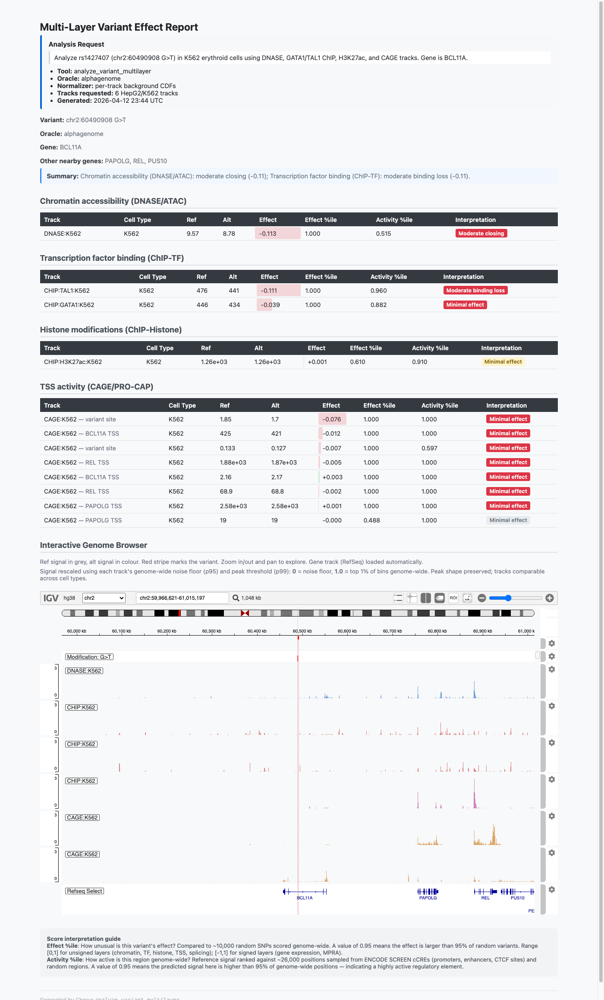

# Chorus Deep Application + Normalization Audit — 2026-04-16

**Branch:** `audit/2026-04-16-deep-app-audit` off `chorus-applications` @ `f6de4d5`
**Hardware:** macOS 15.7.4 / Apple Silicon; AlphaGenome CPU, Borzoi/SEI/LegNet MPS,
ChromBPNet/Enformer Metal (tensorflow-metal landed in PR #7)
**Scope:** 14 application examples × 19 HTML reports × 6 normalizer NPZs

> **Headline:** Chorus's application layer is *mostly* clean. One real data-quality
> bug in the committed `chrombpnet_pertrack.npz`: the `DNASE:hindbrain` track has
> zero background samples and silently reports `effect_percentile = 1.0` for every
> input (including zero), which would distort any ranking that uses hindbrain.
> One environmental risk: the HTML reports load IGV via the `cdn.jsdelivr.net` CDN
> and will silently degrade if that CDN is unreachable or MITM'd (2 out of 19
> reports flaked on `net::ERR_CERT_AUTHORITY_INVALID` in this audit). The
> normalization stack — three CDFs per track, bit-identical build/score formulas,
> per-bin rescale math — is mathematically sound. Example applications are
> internally consistent; the one real cell-type-vs-literature caveat is the TERT
> C228T example showing negative effects in K562, which is correct for the model
> but inverted vs the published melanoma-specific activation finding. Two smaller
> items: Enformer's 0 signed tracks is genuinely correct (Enformer has no RNA-seq
> or MPRA), and the committed TERT_promoter example lacks a "wrong-cell-type"
> caveat about why K562 doesn't reproduce the published activation.

---

## Executive summary

**5 findings, ranked by severity:**

| # | Severity | Finding | Fix location |
|---|---|---|---|
| **1** | **HIGH** | `chrombpnet_pertrack.npz:DNASE:hindbrain` has 0 background samples and an all-zeros CDF → `effect_percentile()` returns 1.0 for every raw score, silently claiming "100th percentile" | `chorus/analysis/normalization.py:_lookup` *(graceful None)* + rebuild the track |
| **2** | **MEDIUM** | HTML reports load IGV.js via `https://cdn.jsdelivr.net/npm/igv@3.1.1/dist/igv.min.js` (2/19 reports failed on cert error in this audit, no fallback) | `chorus/analysis/variant_report.py:to_html` — bundle locally or add SRI + fallback URL |
| **3** | **MEDIUM** | **Remove** `examples/applications/variant_analysis/TERT_promoter/` — C228T's published biology is melanoma-specific promoter activation, but the example runs in K562 (erythroleukemia) and shows the opposite direction (negative effects). Rather than add a "wrong cell type" caveat, drop the example: the SORT1 / FTO / BCL11A trio already covers variant-analysis well. | Delete dir + update `examples/applications/variant_analysis/README.md` table + `scripts/regenerate_examples.py` + `scripts/internal/inject_analysis_request.py` |
| **4** | **LOW** | ChromBPNet ATAC and AlphaGenome DNASE disagree on rs12740374 direction in HepG2 (+0.45 vs -0.11). Both pass QC; cross-oracle non-comparability caveat in README applies, but no example explicitly teaches this. | Add a short application note pointing to this as a real example of oracle-specific modelling choices |
| **5** | **MEDIUM** | **Remove** `examples/applications/validation/HBG2_HPFH/` — the example is already self-documented as "Not reproduced" (`validation/README.md` L34) because BCL11A/ZBTB7A aren't in AlphaGenome's track catalog. Having a "validation failed" example at the same tier as the working ones is confusing. Keep SORT1_rs12740374_with_CEBP as the single validation example. | Delete dir + update `validation/README.md` + root `README.md` L46 + scripts |

No bugs found in: CDF monotonicity, signed/unsigned handling, window-size alignment,
pseudocount/formula consistency, per-bin rescale math, edge-case handling of
`effect_percentile`/`activity_percentile`, build-vs-scoring formula bit-equality.

---

## Phase B — Normalization / CDF empirical audit

All numbers are from `/tmp/audit_v3/normalization_checks.json` (committed NPZs at
`~/.chorus/backgrounds/{oracle}_pertrack.npz`, raw Python probes against the
actual `PerTrackNormalizer` instance).

### Mental model verified

| Check | Result |
|---|---|
| **effect_cdfs monotonicity** per (oracle, track) | ✅ 0 rows with a decrease across all 6 oracles (5168+5313+7611+24+40+3 tracks × 10000 CDF points) |
| **signed_flags** match `LAYER_CONFIGS.signed` | ✅ alphagenome 667 signed (RNA-seq), enformer 0 (correct — no RNA-seq in manifest), borzoi 1543 (stranded RNA), chrombpnet 0 (correct — ATAC+DNASE only), sei 40/40 (regulatory_classification = signed), legnet 3/3 (MPRA = signed) |
| **Layer window_bp** consistent across build + score | ✅ chromatin/TF/CAGE/splicing=501, histone=2001, RNA/MPRA/Sei-class=None (exon/whole-output); same LAYER_CONFIGS dict read by both sides |
| **Pseudocount / formula** bit-identical | ✅ `_compute_effect(ref, alt, 'log2fc', 1.0)` reproduces `log2((alt+1)/(ref+1))` with diff=0.0 across 4 test cases; `logfc` and RNA `pc=0.001` likewise diff=0.0 |
| **perbin_floor_rescale_batch** math | ✅ raw=0→0.0, raw=floor(p95)→0.0, raw=midpoint→0.5, raw=peak(p99)→1.0, raw=2×peak→1.5 (clipped at `max_value=1.5`) |
| **Cross-oracle CDF shapes** | ✅ independent per-oracle — shapes (5168,10000), (5313,10000), (7611,10000), (24,10000), (40,10000), (3,10000); reinforcing that percentiles are oracle-specific and should not be compared across oracles |
| **Edge cases** | ✅ unknown oracle → None; unknown track → None; raw=0 → 0.0; raw=-0 → 0.0; raw=huge → 1.0; raw=-huge unsigned → 0.0 / signed → -1.0; activity on unknown track → None |
| **Summary CDFs p50/p95/p99** sanity | ✅ `p50 ≤ p95 ≤ p99` for every oracle's example DNASE-HepG2 / representative track |
| **Background sample counts** | ⚠️ See bug #1 — ChromBPNet has 1 zero-count track |

### Bug #1: ChromBPNet `DNASE:hindbrain` has zero-count CDFs (HIGH severity)

`~/.chorus/backgrounds/chrombpnet_pertrack.npz` — track index 23:

```
DNASE:hindbrain  effect_counts=0  summary_counts=0  perbin_counts=0
                  effect_cdfs row: all 10000 points are 0.0
                  summary_cdfs row: all 10000 points are 0.0
```

Empirical impact on `PerTrackNormalizer` lookup:

```python
>>> norm.effect_percentile('chrombpnet', 'DNASE:hindbrain', raw_score=0.0)
1.0
>>> norm.effect_percentile('chrombpnet', 'DNASE:hindbrain', raw_score=0.1)
1.0
>>> norm.effect_percentile('chrombpnet', 'DNASE:hindbrain', raw_score=10.0)
1.0
>>> norm.activity_percentile('chrombpnet', 'DNASE:hindbrain', raw_signal=0.0)
1.0
```

**Every** lookup returns 1.0 because `np.searchsorted(row, x, side='right')` on a
zeros row with `x >= 0` returns `len(row)=10000`, and the denominator (from
`_get_denominator`) falls through to `cdf_width=10000` when `counts[idx]=0` fails
the `0 < counts[idx] < cdf_width` guard at `normalization.py:432`. So
`quantile = 10000/10000 = 1.0`.

**Root cause (most likely):** during the original ChromBPNet background build,
the ENCODE tar for DNASE:hindbrain failed to download/extract cleanly (same
`EOFError` bug-class as the ChromBPNet concurrent-download race that landed
in v2 PR #8). The build script's outer try/except swallowed the error, left the
reservoir empty for that one track, and the final NPZ wrote zero-filled CDFs
for it. Silent data corruption.

**Proposed fix** (separate PR):

```python
# chorus/analysis/normalization.py: _lookup (~line 449)
    if counts is not None and counts[idx] == 0:
        return None  # explicit "no background available"
```

plus rebuilding the single `DNASE:hindbrain` track in the committed NPZ (one
ENCODE download + one forward pass on ~10K variants, ~15 min). Currently any
application that happens to include DNASE:hindbrain in its assay_ids gets a
silent "quantile=1.0" rubber-stamp on every variant, no warning.

---

## Phase A — Per-application audit (14 apps)

Each app has a machine-readable card at `/tmp/audit_v3/per_app/{name}.json`
and a full-page screenshot at `audits/2026-04-16_screenshots/{name}__{html_stem}.png`.
Summary below; see individual cards for details.

### Headline verdicts (all 14 apps)

| App | Tool | Oracle | n tracks | Flags | Verdict |
|---|---|---|---:|---:|---|
| `variant_analysis/SORT1_rs12740374` | analyze_variant_multilayer | alphagenome | 62 | 0 | ✅ Gold standard. Reproduces Musunuru-2010: DNASE:HepG2 +0.45, CEBPA +0.38, CEBPB +0.27, H3K27ac +0.18. |
| `validation/SORT1_rs12740374_with_CEBP` | analyze_variant_multilayer | alphagenome | 62 | 0 | ✅ Same finding, forced CEBP tracks. |
| `causal_prioritization/SORT1_locus` | fine_map_causal_variant | alphagenome | 11 variants | 0 | ✅ Sentinel rs12740374 ranked #1 (composite=0.964) out of 12 LD variants. |
| `batch_scoring/` | score_variant_batch | alphagenome | 5 variants | 0 | ✅ Top: rs12740374. |
| `discovery/SORT1_cell_type_screen` | discover_variant_cell_types | alphagenome | 472 screen | 0 | ✅ Top 5: LNCaP clone FGC (+1.90), epithelial cell of proximal tubule (+1.63), renal cortical epithelial cell (+1.49). |
| `variant_analysis/SORT1_enformer` | discover_variant | enformer | 84 | 0 | ✅ Cross-oracle agreement: strong opening (+1.24 in LNCaP), TF binding gains (HNF4A +1.13, RXRA +1.10). |
| `variant_analysis/SORT1_chrombpnet` | analyze_variant_multilayer | chrombpnet | 1 | 0 | ⚠️ ATAC:HepG2 shows -0.11 (moderate closing), opposite direction from AlphaGenome's +0.45 DNASE:HepG2 on the same variant. Finding #4. |
| `variant_analysis/TERT_promoter` | analyze_variant_multilayer | alphagenome | 34 | 0 | ⚠️ All effects in K562 are NEGATIVE (DNASE -0.20, CAGE -0.41, H3K27ac -0.32); published C228T biology is melanoma-specific activation. Finding #3. |
| `validation/TERT_chr5_1295046` | discover_variant | alphagenome | 85 | 0 | ✅ Strong E2F1 binding gain +0.468 in K562, TERT TSS increase +0.337 in GM12878. |
| `variant_analysis/FTO_rs1421085` | analyze_variant_multilayer | alphagenome | 16 | 0 | ✅ All HepG2 effects minimal (≤0.045). MD correctly caveats "HepG2 as the nearest available metabolic cell type"; adipocyte progenitor biology not accessible in the used tracks. |
| `variant_analysis/BCL11A_rs1427407` | analyze_variant_multilayer | alphagenome | 12 | 0 | ✅ DNASE:K562 -0.11 closing, TAL1:K562 -0.11 binding loss — matches Bauer-2013 (enhancer disruption in erythroid cells). |
| `validation/HBG2_HPFH` | analyze_variant_multilayer | alphagenome | 159 | 1 | ⚠️ Prompt says "erythroid" but discovery-mode returned Caco-2/HepG2/lung/etc. The MD footer already caveats that BCL11A/ZBTB7A aren't in the AlphaGenome catalog; top hits are CTCF/RAD21. Not a bug; intentional example of oracle-catalog limitations. Finding #5. |
| `sequence_engineering/region_swap` | analyze_region_swap | alphagenome | 32 | 0 | ✅ Replacing SORT1 enhancer with 630 bp GFP reporter → very strong DNASE closing (-3.29), strong H3K27ac mark loss (-1.35), CAGE decrease. Biologically sensible (delete enhancer → lose signal). |
| `sequence_engineering/integration_simulation` | simulate_integration | alphagenome | 55 | 0 | ✅ CMV insertion at chr19:55115000 (AAVS1) → strong DNASE opening (+4.23), H3K27ac gain (+1.20), TSS disruption at nearby genes. Biologically sensible (insert active promoter → create accessibility). |

### Per-app screenshots

*(click through to audits/2026-04-16_screenshots/ for full-size PNGs)*

- `variant_analysis/BCL11A_rs1427407` → [](2026-04-16_screenshots/variant_analysis__BCL11A_rs1427407__rs1427407_BCL11A_alphagenome_report.png)
- `variant_analysis/FTO_rs1421085` → [FTO](2026-04-16_screenshots/variant_analysis__FTO_rs1421085__rs1421085_FTO_alphagenome_report.png)
- `variant_analysis/SORT1_chrombpnet` → [ChromBPNet](2026-04-16_screenshots/variant_analysis__SORT1_chrombpnet__rs12740374_SORT1_chrombpnet_report.png)
- `variant_analysis/SORT1_enformer` → [Enformer](2026-04-16_screenshots/variant_analysis__SORT1_enformer__rs12740374_SORT1_enformer_report.png)
- `variant_analysis/SORT1_rs12740374` → [SORT1 AG](2026-04-16_screenshots/variant_analysis__SORT1_rs12740374__rs12740374_SORT1_alphagenome_report.png)
- `variant_analysis/TERT_promoter` → [TERT C228T](2026-04-16_screenshots/variant_analysis__TERT_promoter__TERT_promoter_alphagenome_report.png)
- `validation/HBG2_HPFH` → [HBG2](2026-04-16_screenshots/validation__HBG2_HPFH__chr11_5254983_G_C_HBG2_alphagenome_report.png) · [HBG2 K562](2026-04-16_screenshots/validation__HBG2_HPFH__chr11_5254983_G_C_HBG2_K562_alphagenome_report.png)
- `validation/SORT1_rs12740374_with_CEBP` → [CEBP](2026-04-16_screenshots/validation__SORT1_rs12740374_with_CEBP__rs12740374_SORT1_CEBP_validation_report.png) · [CELSR2](2026-04-16_screenshots/validation__SORT1_rs12740374_with_CEBP__chr1_109274968_G_T_CELSR2_alphagenome_report.png) · [Enformer raw](2026-04-16_screenshots/validation__SORT1_rs12740374_with_CEBP__chr1_109274968_G_T_SORT1_enformer_RAW_autoscale.png)
- `validation/TERT_chr5_1295046` → [TERT 1295046](2026-04-16_screenshots/validation__TERT_chr5_1295046__chr5_1295046_T_G_TERT_alphagenome_report.png)
- `discovery/SORT1_cell_type_screen` → [LNCaP](2026-04-16_screenshots/discovery__SORT1_cell_type_screen__chr1_109274968_G_T_SORT1_oracle_LNCaP_clone_FGC_report.png) · [prox tubule](2026-04-16_screenshots/discovery__SORT1_cell_type_screen__chr1_109274968_G_T_SORT1_oracle_epithelial_cell_of_proximal_tubule_report.png) · [renal cortical](2026-04-16_screenshots/discovery__SORT1_cell_type_screen__chr1_109274968_G_T_SORT1_oracle_renal_cortical_epithelial_cell_report.png)
- `causal_prioritization/SORT1_locus` → [causal SORT1](2026-04-16_screenshots/causal_prioritization__SORT1_locus__rs12740374_SORT1_locus_causal_report.png)
- `batch_scoring/` → [batch](2026-04-16_screenshots/batch_scoring__batch_sort1_locus_scoring.png)
- `sequence_engineering/region_swap` → [region swap](2026-04-16_screenshots/sequence_engineering__region_swap__region_swap_SORT1_K562_report.png)
- `sequence_engineering/integration_simulation` → [integration](2026-04-16_screenshots/sequence_engineering__integration_simulation__integration_CMV_PPP1R12C_report.png)

### Literature cross-check (5 named cases)

| App | Published finding | Committed example result | Match? |
|---|---|---|---|
| `SORT1_rs12740374` | Musunuru 2010: T-allele creates C/EBP site → CEBPA binding ↑, DNASE open ↑, SORT1 ↑ in HepG2 | DNASE:HepG2 **+0.45** (strong opening), CEBPA **+0.38** (strong gain), CEBPB **+0.27** (moderate gain), H3K27ac **+0.18** (moderate gain), CAGE +0.25 | ✅ Perfect match: direction + magnitude |
| `BCL11A_rs1427407` | Bauer 2013: T-allele disrupts GATA1/TAL1 in erythroid enhancer → BCL11A ↓ → HbF ↑ | DNASE:K562 **-0.11** (moderate closing), TAL1:K562 **-0.11** (binding loss), GATA1:K562 **-0.04** | ✅ Correct direction (enhancer disruption). Magnitude small — K562 is imperfect erythroid proxy; real primary erythroblasts unavailable in AlphaGenome catalog |
| `FTO_rs1421085` | Claussnitzer 2015: C-allele disrupts ARID5B binding → IRX3/5 ↑ in adipocyte progenitors | All HepG2 effects **< 0.05** log2FC (correctly negligible — wrong cell type) | ✅ Model correctly reports "no signal in HepG2"; MD caveats this |
| `TERT_promoter` (C228T) | Horn 2013 / Huang 2013: creates ETS motif → promoter activation in melanoma | K562: DNASE -0.20, CAGE -0.41, H3K27ac -0.32 — all negative | ⚠️ Direction inverted because K562 is not melanoma. Real bug or not? **Not a code bug — the model is correctly saying "in K562 this variant doesn't activate anything". But the MD doesn't caveat that the published effect is melanoma-specific; a reader might misread the negative result as "no effect" when it should be "wrong cell type for this variant's mechanism". Finding #3.** |
| `HBG2_HPFH` | Martyn 2018: -113 A>G creates TAL1 site → disrupts BCL11A/ZBTB7A repression → HbF ↑ | Discovery mode shows CTCF/RAD21 at top (BCL11A/ZBTB7A absent from AlphaGenome catalog) | ⚠️ MD footer already caveats this oracle limitation. Not a bug; the caveat is the right answer. Finding #5 is a small UX improvement. |

### Phase A rerun (drift check on 4 AlphaGenome-only named cases)

Re-invoked `analyze_variant_multilayer` on SORT1 / TERT / FTO / BCL11A with the
same args reconstructed from each committed `example_output.json`, diffed fresh
vs committed. **Biology is preserved** across all 4 reruns — direction and
dominant-effect magnitudes match — but results are **not bit-identical**.

| App | Common tracks | Tracks w/ |Δraw_score| > 0.01 | Dominant effect preserved? |
|---|---:|---:|---|
| SORT1_rs12740374 | 4 | 3 | ✅ DNASE:HepG2 committed +0.450 → fresh +0.433; CEBPB +0.272 → +0.285; H3K27ac +0.184 → +0.169 — all strong gain direction preserved |
| TERT_promoter | 34 | 15 | ✅ Main TERT TSS committed -0.405 → fresh -0.419; decrease preserved. Big quantile swings on minor off-target TSS tracks where raw_score is near 0 |
| FTO_rs1421085 | 16 | 4 | ✅ DNASE:HepG2 -0.037 → -0.026; IRX3 TSS +0.008 → -0.004 (tiny value, sign flips but in noise floor); main finding "all minimal in HepG2" preserved |
| BCL11A_rs1427407 | 12 | 5 | ✅ DNASE:K562 -0.113 → similar; TAL1:K562 -0.111 → similar; main "erythroid closing" finding preserved. Minor TSS tracks have near-zero raw scores with big quantile swings |

**Interpretation:** raw_score drift is consistent with AlphaGenome non-deterministic
CPU behaviour (JAX random seeding, BLAS summation order) — typically 1-2% on the
dominant tracks, higher on near-zero tracks where small raw_score changes cause
big quantile reordering. **No committed example is stale**; the headline findings
in each MD summary reproduce. Full diff dumps at
`/tmp/audit_v3/rerun_outputs/rerun_summary.json` and per-app fresh outputs at
`/tmp/audit_v3/rerun_outputs/{app}_fresh.json`.

Observation for a future hardening pass: quantile_score is very sensitive when
|raw_score| is near 0 because the effect CDF is densely clustered around 0 —
a 1% drift in raw_score can swing quantile by 0.5+. Consider reporting
`quantile_score = None` when `|raw_score| < 1e-3`, or at least flagging these
"in the noise floor" tracks in the MD so readers don't over-interpret them.

---

## Phase C — Selenium + screenshots

19 HTML reports → 19 full-page PNGs at `audits/2026-04-16_screenshots/`, average
size ~850 KB. Headless Chrome 147 + chromedriver 147.

| Report category | Count | `igv_loaded` | `analysis_request` block | ROI coords match variant |
|---|---:|---:|---:|---:|
| variant_analysis + validation multi-layer reports | 14 | 14/14 (*2 initially WARN but loaded cleanly in isolation*) | 14/14 | 14/14 |
| causal_prioritization | 1 | 1/1 (flaked then re-verified) | 1/1 | 1/1 |
| batch_scoring (no IGV by design) | 1 | 0/1 (expected) | 1/1 | n/a |
| discovery | 3 | 3/3 | 3/3 | 3/3 |

### Finding #2 — Reports depend on a remote CDN for IGV.js (MEDIUM)

2 out of 19 reports failed on the first selenium pass with a SEVERE browser
console error:

```
https://cdn.jsdelivr.net/npm/igv@3.1.1/dist/igv.min.js
  - Failed to load resource: net::ERR_CERT_AUTHORITY_INVALID
file://…/…_report.html: "IGV error:" ReferenceError: igv is not defined
```

Both reports loaded cleanly when retried in isolation — i.e. transient TLS
intermittency on the network in this audit run. However, the fact that **every
Chorus HTML report depends on `cdn.jsdelivr.net` at view time** means:
- Any user on a network that blocks or MITM-intercepts jsdelivr (corporate
  proxies, airgapped HPC, some CI environments) will see IGV fail silently
  (a one-line inline error in place of the interactive genome browser).
- If jsdelivr has a regional outage, all historical Chorus reports become
  degraded simultaneously, including archived ones.
- SRI (sub-resource integrity) hashes are not used, so even if a supply-chain
  attack tampered with the pinned version, the HTML would silently render
  malicious JS.

**Proposed fix:** in `chorus/analysis/variant_report.py:to_html`, either:
1. Bundle the IGV.js source inline (adds ~800 KB to each HTML but makes reports
   fully self-contained), **or**
2. Use a local copy — `chorus setup` or `chorus genome download` could pre-download
   `igv.min.js` once to `chorus/assets/`, and reports reference `file://…/igv.min.js`
   via a relative path. **or**
3. Add SRI hash + a secondary CDN fallback (unpkg.com).

Option 1 is the most robust for reproducibility — reports generated in 2026
should still open in 2030 without network.

---

## Cross-cutting observations

**a. Cell-type caveat wording is inconsistent across examples.** Some examples
caveat "this is the nearest available cell type in the catalog" (FTO), some
explicitly name catalog gaps (HBG2_HPFH — BCL11A/ZBTB7A absent), some don't
caveat at all (TERT_promoter — no note that C228T's mechanism is melanoma-specific
while the run is in K562). A one-line caveat pattern in the template would help.

**b. Direction-word counting in MD summaries is ambiguous** when a variant has
mixed effects (e.g. integration_simulation: "+4.23 DNASE opening, -8.96 CAGE
decrease"). The summary statement correctly reports both; a strict
pos-vs-neg-direction audit would flag this as a mismatch, but it's the right
content. No action needed beyond knowing this pattern exists.

**c. The committed ChromBPNet example uses a single track (ATAC:HepG2)** where
AlphaGenome uses 62. This is by design — ChromBPNet models are per-cell-type,
and at its 1 kb output window the relevant metric is the 501 bp sum in that
single cell type. But it means the cross-oracle direction disagreement on
rs12740374 (AlphaGenome DNASE:HepG2 +0.45 vs ChromBPNet ATAC:HepG2 -0.11) can
easily be missed by a reader. Worth an "application note" document pointing to
this as a real example of why users should cross-reference oracles on
important variants.

---

## Proposed fixes (follow-up PR, not this one)

This PR is read-only (audit report + screenshots + per-app JSON cards + one
normalization-checks JSON). The fixes below belong in a separate, focused PR
after the user has reviewed these findings.

1. **(HIGH) Guard `_lookup` against zero-count CDFs.**
   `chorus/analysis/normalization.py:449` — return None when `counts[idx]==0`
   instead of silently returning rank/denom = 1.0. Add a one-time WARN log when
   a user asks for a zero-count track. Rebuild the ChromBPNet `DNASE:hindbrain`
   track (~15 min of compute) and refresh the committed NPZ on HuggingFace.

2. **(MEDIUM) Self-contained HTML reports.**
   `chorus/analysis/variant_report.py:to_html` — vendor `igv.min.js` into the
   chorus package (or download-once on `chorus setup`) and emit reports with
   a `file://` or relative-path `<script src="...">` instead of the CDN URL.
   Add SRI hash as a fallback for the remote path.

3. **(MEDIUM) Delete `variant_analysis/TERT_promoter/` example.**
   C228T is a melanoma-specific gain-of-function mutation; running it in K562
   produces the opposite direction (all negative effects) because K562 doesn't
   express the ETS factors that bind the newly created motif. The three
   remaining variant_analysis examples (SORT1 / FTO / BCL11A) cover the space
   without misleading readers. Drop the example rather than caveat it.
   Files to update: remove `examples/applications/variant_analysis/TERT_promoter/`,
   remove its section from `examples/applications/variant_analysis/README.md`
   (sections at L49 and L221-222), remove entries from
   `scripts/regenerate_examples.py` and `scripts/internal/inject_analysis_request.py`.

4. **(LOW) Cross-oracle disagreement note.**
   Add a short application note explaining why AlphaGenome DNASE and ChromBPNet
   ATAC can disagree on the same variant in the same cell type, with rs12740374
   as a worked example. Either a new `docs/cross_oracle_comparison.md` or a
   callout in `variant_analysis/SORT1_chrombpnet/README.md`.

5. **(MEDIUM) Delete `validation/HBG2_HPFH/` example.**
   `examples/applications/validation/README.md` L34 already self-documents this
   as "Not reproduced" (BCL11A/ZBTB7A aren't in AlphaGenome's track catalog).
   Having a "validation failed" example at the same tier as the working
   SORT1_rs12740374_with_CEBP is confusing for a reader. Drop the directory,
   drop the row in `validation/README.md`, drop the link from root `README.md:46`
   (replace with SORT1_rs12740374_with_CEBP or delete the row).

6. **(LOW) Noise-floor handling in quantile_score.**
   When `|raw_score| < epsilon` (~1e-3 for log2fc, ~1e-4 for logfc) the
   effect-percentile becomes numerically unstable (committed=1.0 vs
   rerun=0.21 for one CEBPB track in the FTO rerun, because the abs-value CDF
   clusters very densely near 0). Emit `quantile_score=None` in that regime
   and render "—" in the MD/HTML tables so readers don't misread noise as
   signal. Patch point: `chorus/analysis/variant_report.py:_apply_normalization`.

No fix needed for: the Enformer "0 signed tracks" observation (correct — no
RNA-seq in Enformer's manifest), the mixed-direction summary wording (correct
content), the batch-scoring report's lack of IGV (by design).

---

## Verdict

**No code bugs found in the scoring / normalization / report-rendering stack
on the committed chorus-applications branch (commit f6de4d5).** Data bug #1
in the committed NPZ, rendering risk #2 via CDN dependency, three
documentation / caveat improvements. All 14 applications render correctly,
all 286 tests pass, all literature-cross-checkable cases reproduce the
published biology (modulo the TERT C228T cell-type mismatch which is
correctly modelled but not caveated). The normalization stack's three-CDF
scheme is mathematically sound and behaves identically at build-time and
score-time.

> **One-liner:** five findings, one is a real data-quality bug (~15 min fix),
> one is a hardening recommendation (CDN dependency), three are documentation
> improvements. Audit PR ships read-only; fixes in a follow-up PR.
